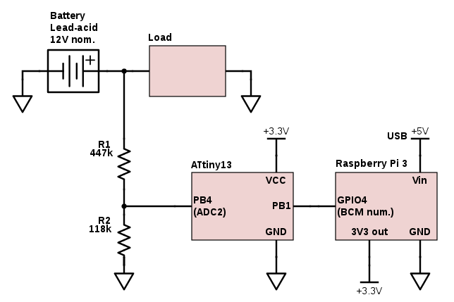

# Raspberry Pi battery monitor

This project monitors the voltage and, indirectly, charge status of a 12 volt
lead-acid battery, e.g. a car starter battery or a marine deep-cycle battery.
The voltage readings are sent to a [Raspberry Pi](https://www.raspberrypi.org/)
where you can plot them, set up alerts, send them over the network or do
anything else you want. This sort of thing has been done many times before, but
you might find my approach interesting.

## The hardware

Because the Raspberry Pi doesn't have an analog-to-digital converter, we need
some kind of external component to take voltage readings.  Many people use
dedicated SPI or I²C ADC chips for this. I elected to use an
[ATtiny13](http://www.mouser.com/ds/2/268/doc8126-1066157.pdf) AVR
microcontroller because it's what I had in my parts bin. Here's a schematic:



The load is just whatever you're powering from the battery. In my case I'm
powering the RPi itself from the battery, through a car-style USB power
adapter.  But that's not essential to the operation of the circuit, as long as
all the grounds are tied together.

The positive terminal of the battery is connected to an analog input pin on the
ATtiny13, through two resistors functioning as a [voltage
divider](https://learn.sparkfun.com/tutorials/voltage-dividers).  I measured
these resistors myself which is why they're slightly off of the standard
values. You can use any pair of resistors in approximately the same ratio.
Just be sure to adjust the `R1` and `R2` values in
[`src/main.rs`](src/main.rs). However, if you make the resistors too small, the
system will waste more power.  At these values, the divider will consume about
20 μA, which isn't much to an 85 amp-hour battery!

The maximum analog reading on the ATtiny13 is equal to its supply voltage, 3.3 V
here. So the maximum battery voltage we can measure is

> 3.3 V × (447 kΩ + 118 kΩ) / 118 kΩ
>
> = 15.8 V.

Since the ADC reads 10 bits, the voltage resolution is 15.8 V / 1024 = 15.4 mV.

Here's the full setup:


And a close-up of the sensor circuit:


Parts list, including powering the Pi:

* Marine deep cycle battery from AutoZone
* [12V fused plug socket with eyelet terminals](https://www.amazon.com/gp/product/B00G8WLW2Y)
* [33W USB car charger](https://www.amazon.com/gp/product/B00OZ5OIFE)
* [USB power meter](https://www.adafruit.com/product/2690)
* [USB A to Micro-B cable](https://www.amazon.com/gp/product/B00NH13O7K)
* [Raspberry Pi 3 Model B](https://www.adafruit.com/product/3055)
* [Raspberry Pi case](https://www.adafruit.com/product/2253) with [lid](https://www.adafruit.com/product/2257)
* 32 GB MicroSD card
* 64 GB USB flash drive (much faster than MicroSD!)
* Basic perfboard
* [ATtiny13a in PDIP-8 package](http://www.mouser.com/search/ProductDetail.aspx?R=0virtualkey0virtualkeyATTINY13A-PU)
* Two resistors
* Miscellaneous wire

## The software

The ATtiny13 sends an ADC sample to the RPi every 100 ms. There is no need for
bidirectional communication, so I used just a single data line. However the
ATtiny13's internal RC oscillator does not provide enough clock stability for
asynchronous serial transmission. I solved this problem using a [Manchester
code](https://en.wikipedia.org/wiki/Manchester_code), which allows the receiver
to recover the sender's bit clock. Each bit transmission takes 1 ms, divided
into two halves for the Manchester code.  So the data rate is 1000 bps.

Each transmission consists of 17 bits: a start bit which is always 1, a 10-bit
ADC sample, and a 6-bit "signature". The signature provides some ability to
detect garbled transmissions, and also ensures that the signal includes the
necessary waveforms for clock recovery. The ADC sample is sent with the least
significant bit first. Between transmissions, the bus is at 0 V, a logic low
state.

The software on the RPi side is in [`src/`](src/). Most of it is written in
[Rust](https://www.rust-lang.org), including the Manchester decoding and the
computation of battery voltage. Low-level access to the Raspberry Pi GPIO pins
is coded in C, based on a [code sample from the eLinux wiki](http://elinux.org/RPi_GPIO_Code_Samples#Direct_register_access).
Rust could do this as well, but the C code contains some gnarly macros and I
didn't want the hassle of porting them to Rust.

For speed, I am using direct access to the memory-mapped GPIO registers,
rather than the Linux `sysfs` interface. The era of [`PEEK` and `POKE`](https://en.wikipedia.org/wiki/PEEK_and_POKE)
lives on!

I've tested this on a Raspberry Pi 3, however it's likely to work on other
models as well.

## Build and install

The ATtiny13 code is very simple and can be found in the [`avr/`](avr/) directory.
To get the tools in Debian:

```
sudo apt-get install gcc-avr avr-libc avrdude
```

Then run `./build-and-upload.sh`. The script is configured to use an [AVRISP
mkII](http://www.atmel.com/tools/avrispmkii.aspx) programmer over USB. If you
have a different programmer, change the `-c` argument to `avrdude`. If you're
using a different AVR microcontroller, e.g. an Arduino Uno, you will need to
edit the script as well as make changes to the code in
[`avr/monitor.c`](avr/monitor.c).

For the RPi side of things, you can install the Rust toolchain on your RPi
[in the usual way](https://rustup.rs/). I've tested this with [Raspbian jessie](https://www.raspberrypi.org/downloads/raspbian/).
You'll also need `gcc`, which is installed by default. The RPi is fairly slow;
a clean build from scratch takes almost 40 seconds. I haven't tried
cross-compiling from a more powerful system. Once you have built dependencies,
a build takes only about 6 seconds.

After you've installed the tools, you can build the code by running

```
cargo build --release
```

in the root directory of this repository. You will get a binary at
`./target/release/rpi-battery-monitor`. Run it with no arguments
to get a battery voltage reading.

This program uses two system features which require it to run as root:

* Direct access to GPIO registers through `/dev/mem`
* Realtime scheduler priority while reading data

## Munin setup

`rpi-battery-monitor` can be used as a [Munin](http://munin-monitoring.org/)
plugin to get pretty graphs. The plugin must run as root, and the
simplest way to accomplish this is by marking it [setuid](https://en.wikipedia.org/wiki/Setuid).
This is **a major security hazard** because, although simple, this program
has not been carefully audited for setuid safety. Thus I recommend you
**only do this on a single-user machine**.

```
# Install the plugin.
sudo cp target/release/rpi-battery-monitor /usr/share/munin/plugins
sudo chown root:root /usr/share/munin/plugins/rpi-battery-monitor
sudo chmod u+s /usr/share/munin/plugins/rpi-battery-monitor
sudo ln -f -s /usr/share/munin/plugins/rpi-battery-monitor /etc/munin/plugins/battery_voltage

# Test run.
sudo munin-run battery_voltage
# Expect output like this: battery_voltage.value 12.197

# Restart Munin so it starts graphing.
sudo service munin-node restart

# Regenerate graphs immediately.
# If you get a lockfile error, try again in a minute.
sudo -u munin /usr/share/munin/munin-html --debug
```

## Configuration

If you want to put the sensor on a different RPi GPIO pin, edit `static const
int pin` in [`src/cbits.c`](src/cbits.c). This uses the Broadcom GPIO numbering,
*not* the RPi GPIO header pin numbering. You can find a [helpful chart here](http://www.raspberrypi-spy.co.uk/2012/06/simple-guide-to-the-rpi-gpio-header-and-pins/).
You will also need to change `BCM2708_PERI_BASE` to `0x20000000` if you're
using a Raspberry Pi 1.

There are many other configuration variables documented in
[`src/main.rs`](src/main.rs). This includes the values for the voltage divider
and the input voltage to the ATtiny13.

Configuration for the Munin graphs is stored in [`src/munin.cfg`](src/munin.cfg).
This file is baked into the binary and therefore you must rebuild after changing
it.

Happy hacking!
